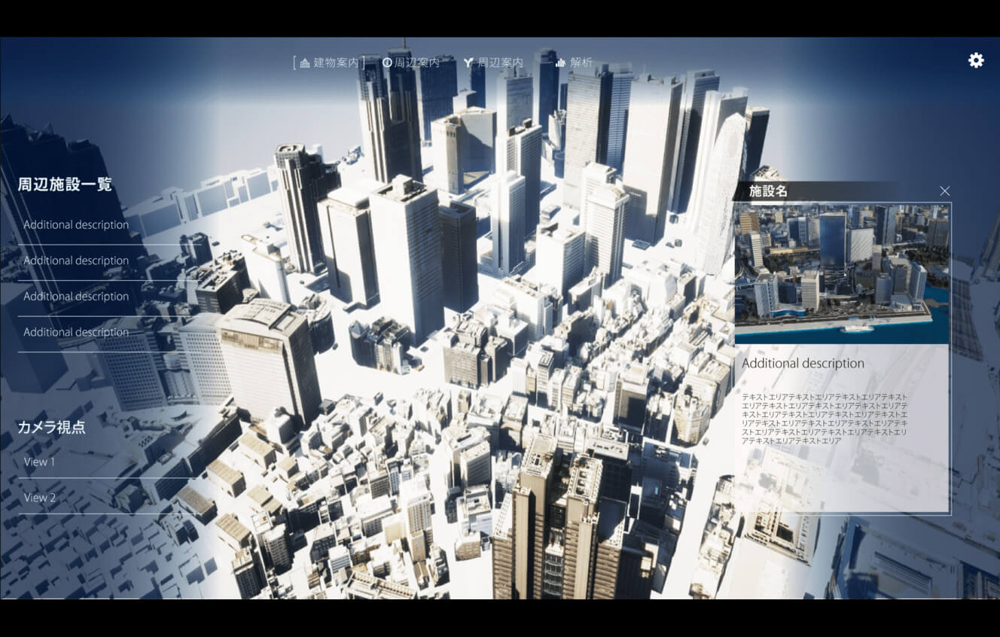

# PLATEAU TwinLink
「3D都市モデル」、「BIMモデル」、「空間ID」を統合した都市開発支援ツールであり、都市計画の検討や都市開発のプロポーザル、建築設計の合意形成、シティプロモーションなど、まちづくりの各フェーズで利用することが可能です。

本ツールのソースコードについては[GitHub](https://github.com/Project-PLATEAU/PLATEAU-TwinLink)を参照してください。
