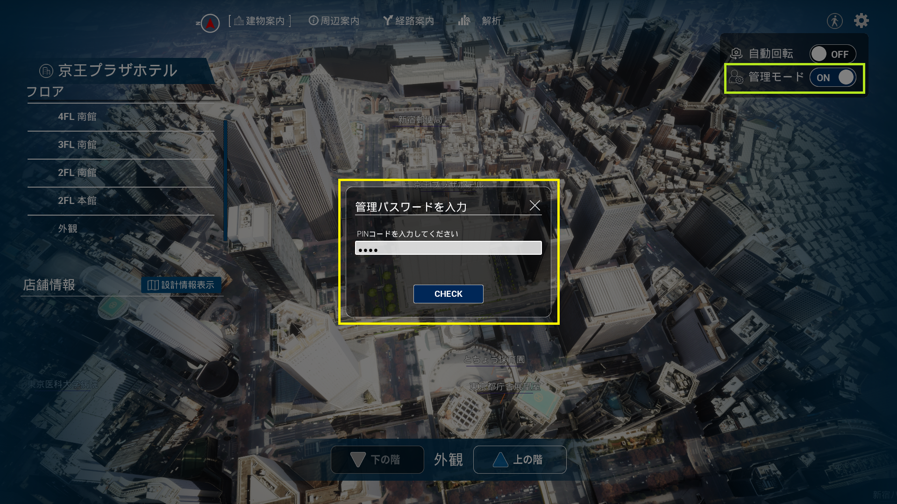
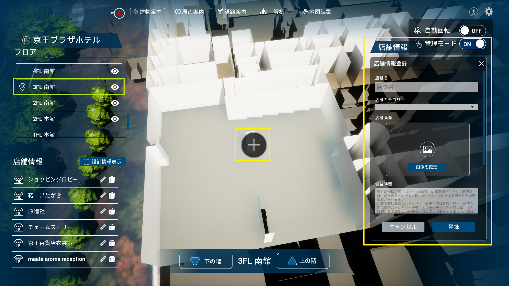
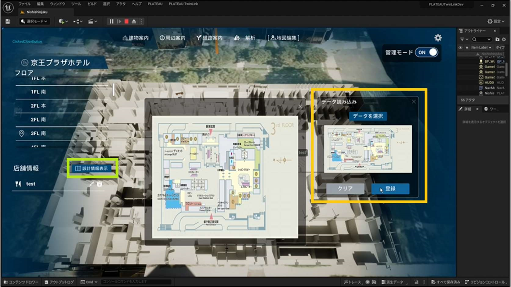
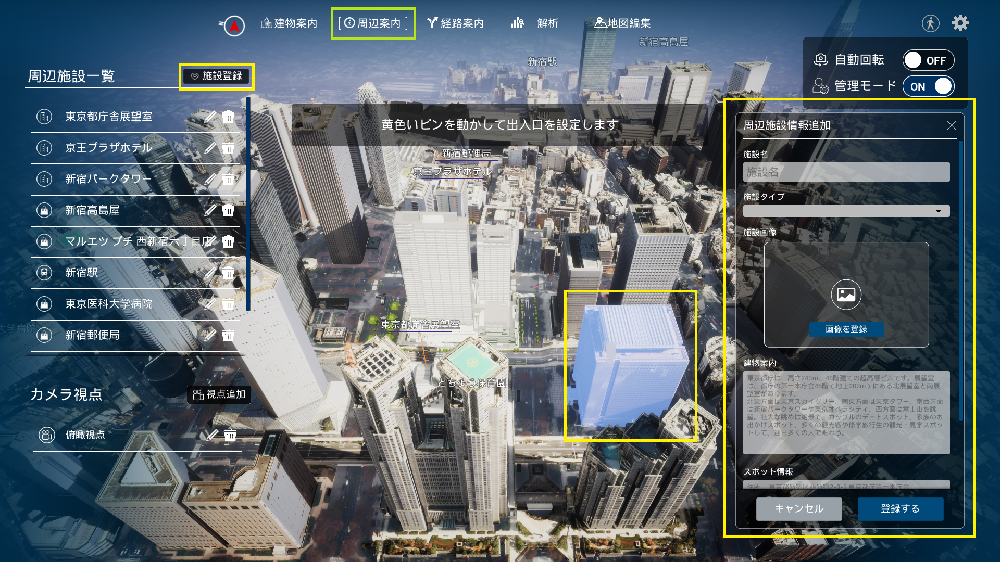
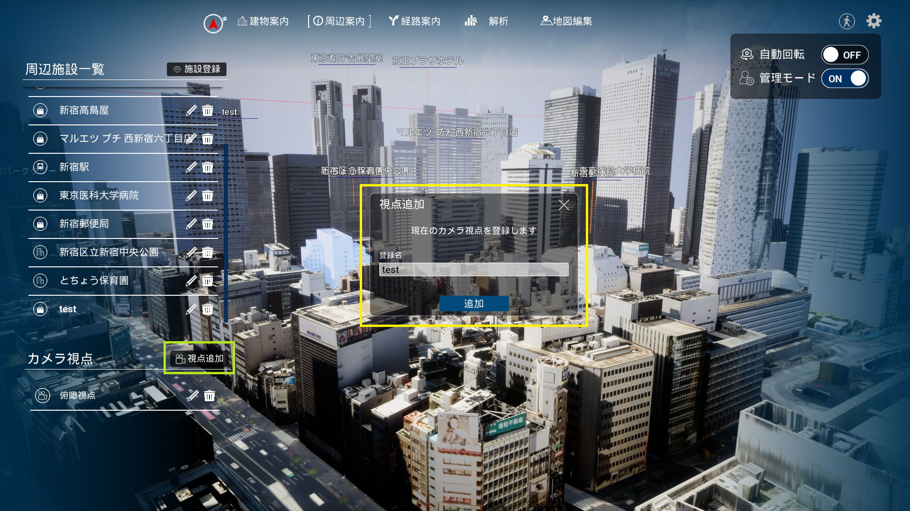
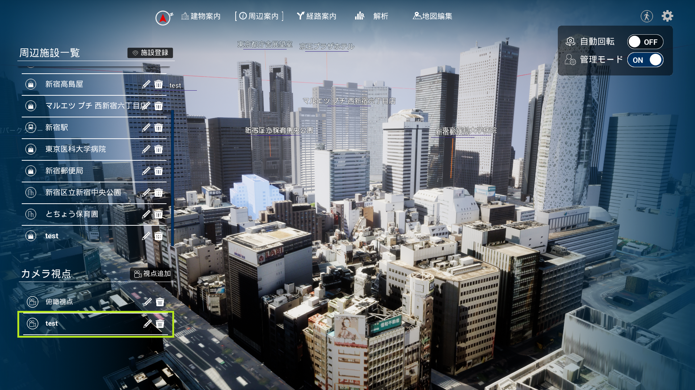
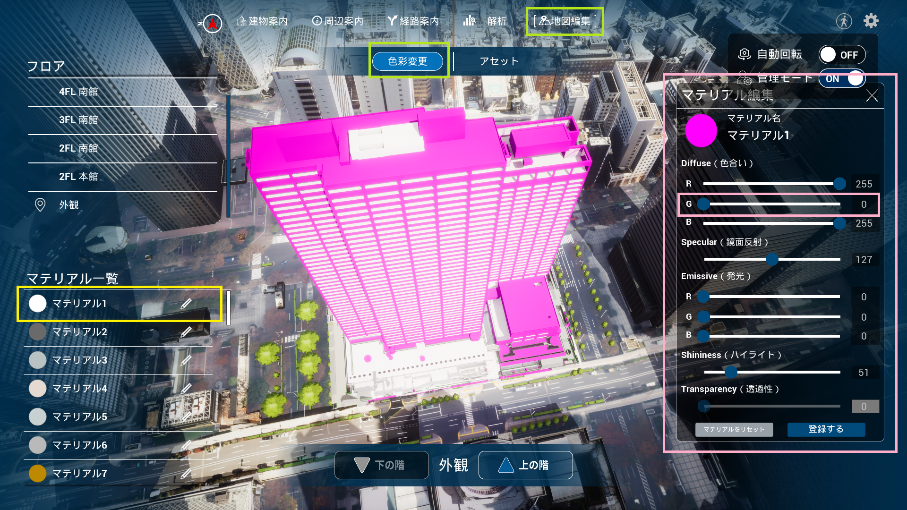
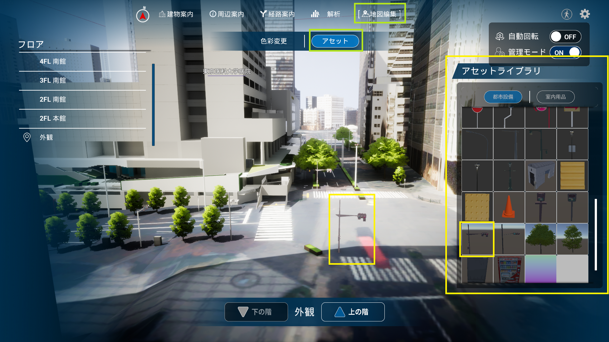
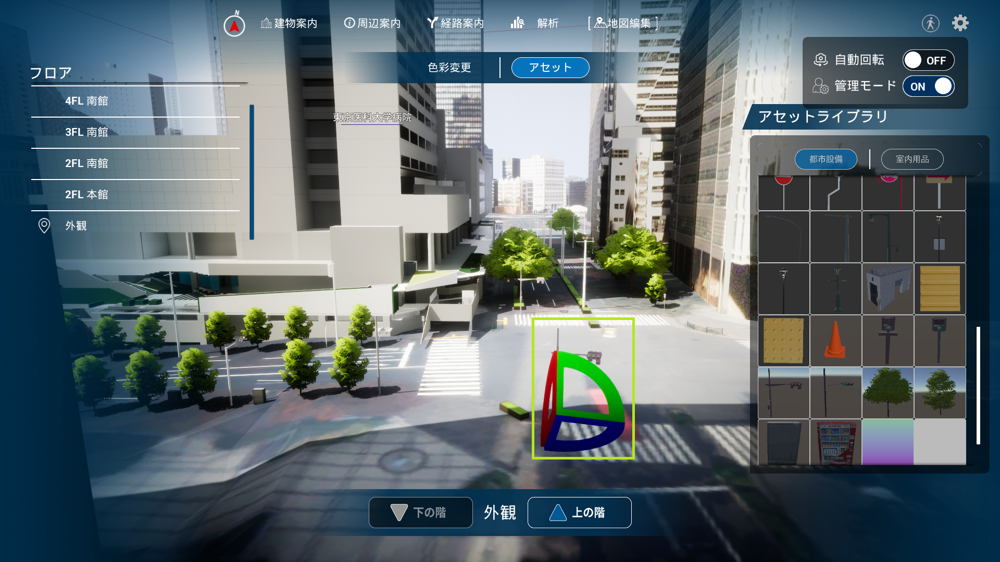
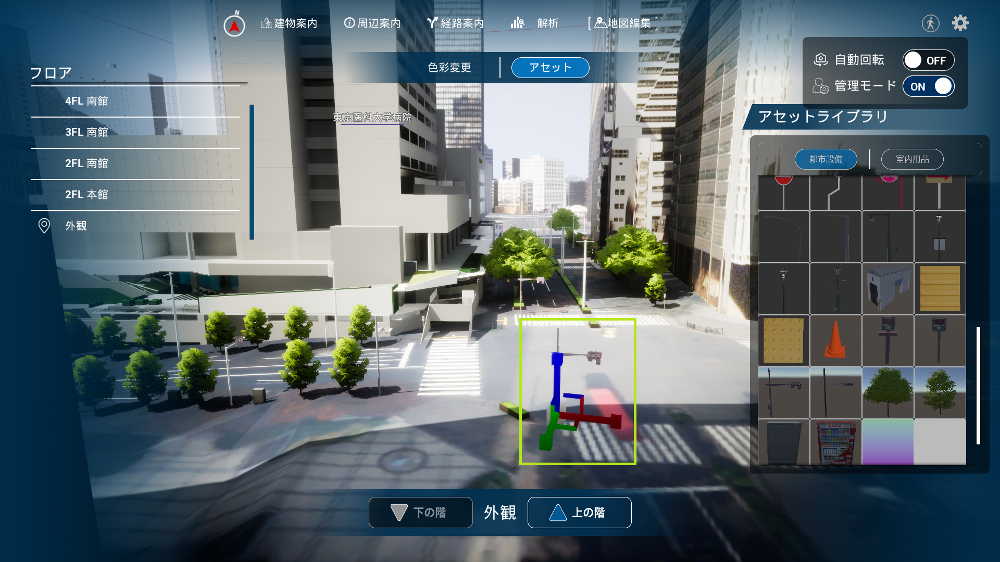

# 建物内施設情報の登録
画面右上の管理モードをON にし、管理者PIN を入力して管理モードに入る。以後、表示データの設定は管理モードで行う。店舗情報を追加したいフロアを画面左のフロアリストから選択する。

店舗の位置をクリックすると、店舗情報登録画面が表示されるので、店舗名などを入力して登録ボタンを押す。

# 建物内設計情報の登録
店舗情報を追加したいフロアを画面左のフロアリストから選択する。画面左下の設計情報表示を選択すると、登録されている設計情報とデータ読み込み画面が表示される。設計情報を登録したい場合は、データを選択して登録する。

# 周辺施設情報の登録
画面上部メニューの「周辺案内」を選択する。登録したい施設をクリックしてから、画面左にある施設登録を選択すると、周辺施設情報追加画面が表示される。施設名などを入力して、登録するボタンを押す。

登録が成功すると、画面左の周辺施設一覧に施設名が追加される。

# 視点の登録
登録したい視点に移動してから、画面左下の視点追加を選択する。視点名を入力して、追加を選択する。

登録された視点は、左下のカメラ視点リストに表示され、選択するとその視点に移動する。

# 建物の色彩変更
画面上部メニューの「地図編集」>「色彩変更」を選択する。画面左下のマテリアル一覧から編集したいマテリアルを選択すると、マテリアル編集画面が表示される。Diffuse（色合い）などを編集し、登録するボタンを選択すると、建物の色彩が変更される。

# アセットの配置
画面上部メニューの「地図編集」>「アセット」を選択する。画面右のアセットライブラリから追加したいアセットを選択して、設置する。

設置したアセットを選択すると回転移動ができ、右クリックすると平行移動できる。

