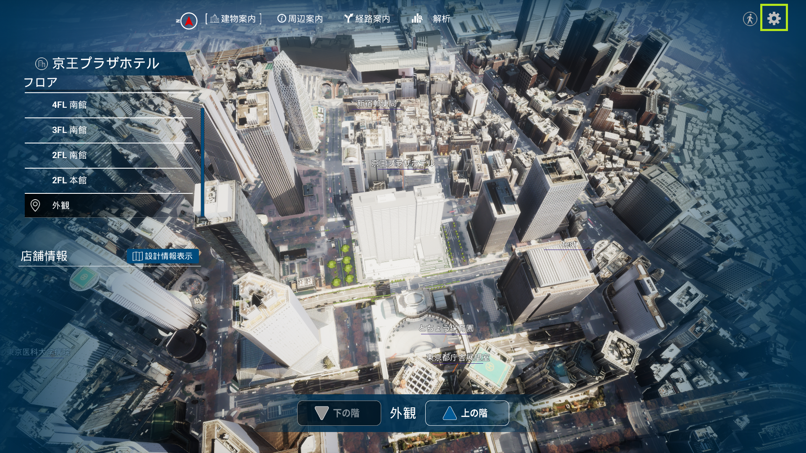

# 表示データの設定方法（管理者用画面）
# 1 本書について
本書では、PLATEAU TwinLink（以下「本ツール」という。）で扱うデータを、管理者が登録・変更する手順について記載しています。

# 2 使い方
本ツールの実行ファイルを実行すると以下のメイン画面が表示されます。

メイン画面右上の歯車ボタンを押すと、管理モード切替ボタンが表示されます。管理モードをONにすると管理者パスワード入力パネルが表示されるため、パスワード（PIN）を入力すると、管理モードに入れます。以後、表示データの設定は管理モードで行います。

## 2-1 建物内施設情報の登録
店舗情報を追加したいフロアを画面左のフロアリストから選択します。店舗の位置をクリックすると、店舗情報登録画面が表示されるので、以下の項目を入力して登録ボタンを押します。
- 店舗名
    - 店舗の表示名を設定します。
- 店舗カテゴリ
    - 店舗リストで表示されるカテゴリを設定します。
    - 例）飲食店、物品販売店
- 店舗画像
    - 店舗情報で表示する画像を設定します。
- 営業時間
    - 店舗情報で表示する営業時間を設定します。
- 店舗案内
    - 店舗情報で表示する店舗案内を設定します。
    - 例）住所、駐車場の有無

## 2-2 建物内設計情報の登録
店舗情報を追加したいフロアを画面左のフロアリストから選択します。画面左下の「設計情報表示」を選択すると、登録されている設計情報とデータ読込み画面が表示されます。設計情報を登録したい場合は、データを選択して登録してください。

## 2-3 周辺施設情報の登録
画面上部メニューの「周辺案内」を選択します。登録したい施設をクリックしてから、画面左にある「施設登録」を選択すると、周辺施設情報追加画面が表示されます。以下の項目を入力して、登録するボタンを押してください。
- 施設名
    - 施設の表示名を設定します。
- 施設タイプ
    - 施設一覧で表示されるタイプを設定します。
    - 例）商業施設、交通施設
- 施設画像
    - 施設情報で表示される画像を設定します。
- 建物案内
    - 施設情報で表示される建物案内を設定します。
    - 例）48階建ての超高層ビル
- スポット情報
    - 例）住所、営業時間

登録が成功すると、画面左の周辺施設一覧に施設名が追加されます。

## 2-4 視点の登録
登録したい視点に移動してから、画面左下の「視点追加」を選択します。視点名を入力して、追加を選択します。

登録された視点は、左下のカメラ視点リストに表示され、選択するとその視点に移動します。

## 2-5 建物の色彩変更
画面上部メニューの「地図編集」>「色彩変更」を選択します。画面左下のマテリアル一覧から編集したいマテリアルを選択すると、マテリアル編集画面が表示されます。以下の項目を編集し、登録するボタンを選択すると、建物の色彩が変更されます。
- Diffuse（色合い）
    - RGBの数値をそれぞれ0～255の範囲で設定します。
- Specular（鏡面反射）
    - 0～255の範囲で設定します。
- Emissive（発光）
    - RGBの数値をそれぞれ0～255の範囲で設定します。
- Shininess（ハイライト）
    - 0～255の範囲で設定します。
- Transparency（透過性）
    - 0.0～1.0の範囲で設定します。

## 2-6 アセットの配置
画面上部メニューの「地図編集」>「アセット」を選択します。画面右のアセットライブラリから追加したいアセットを選択して、設置してください。

設置したアセットを選択すると回転移動ができ、右クリックすると平行移動できます。

