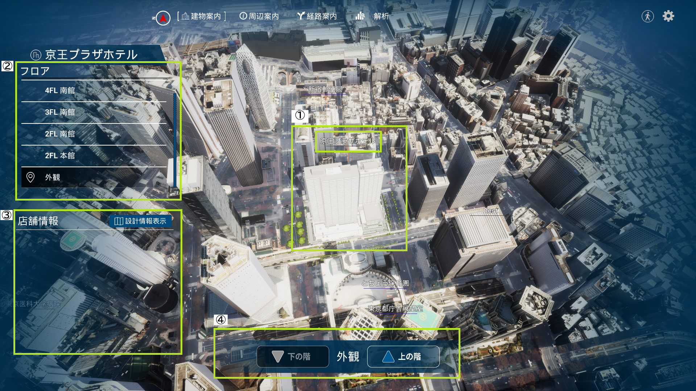
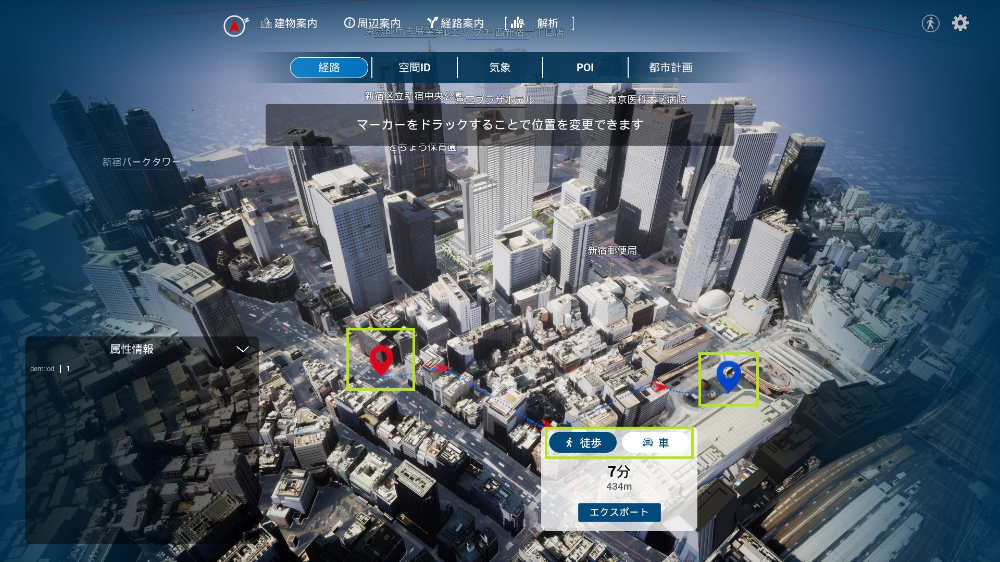
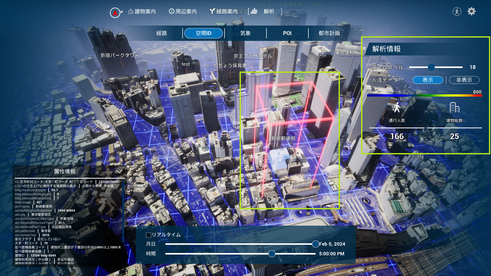
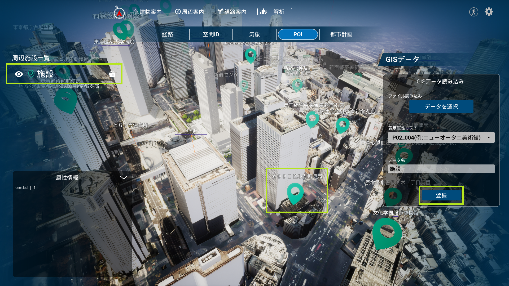
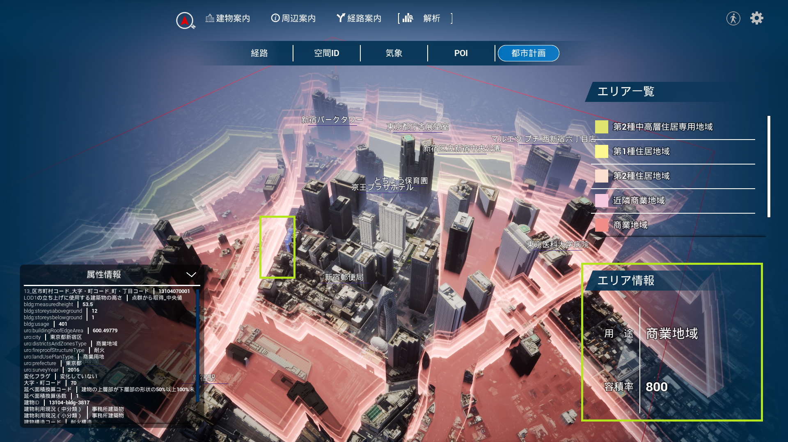

# 建物案内画面
画面上部メニューの「建物案内」を選択する。画面左のフロアリストから閲覧したいフロアを選択すると、そのフロアが切り取られ、登録されている店舗情報が表示される。

# 周辺案内画面
画面上部メニューの「周辺案内」を選択する。画面左の周辺施設一覧から閲覧したい施設を選択すると、画面右に詳細が表示される。画面左下のカメラ視点リストから視点を選択すると、登録した視点にカメラが移動される。

# 経路案内画面
画面上部メニューの「経路案内」を選択する。目標地点に設定したい施設を画面左の周辺施設一覧又は3D マップから選択すると、経路情報が表示される。

# 解析画面
## 経路
画面上部メニューの「解析」>「経路」を選択する。3D マップ上で出発地点→目標地点の順で選択すると、経路情報が表示される。経路情報はエクスプポートボタンを選択すると、Shapefile として出力される。

## 空間ID
画面上部メニューの「解析」>「空間ID」を選択する。3D マップ上の調べたいエリアを選択すると、赤色のボクセルとそのボクセルの範囲内を対象とした解析情報が表示される。ボクセルのサイズはズームレベルのバーで変更できる。

## 気象
画面上部メニューの「解析」>「気象」を選択する。画面右の気象データで、データを選択ボタンから閲覧したい気象データを選ぶと、3D マップ上に気象情報が表示される。気象情報の測定位置は黄色矢印で表示され、これらの表示は視点が測定位置から離れると自動的に非表示になる。

## POI
画面上部メニューの「解析」>「POI」を選択する。画面右のGIS データで読み込みたいファイルを指定、属性を選び、データ名を入力してから登録ボタンを選択する。データが登録されると3D マップ上に緑色矢印と情報が表示される。

## 都市計画
画面上部メニューの「解析」>「都市計画」を選択する。画面右のエリア一覧に指定された色で、3D マップの各エリアが色分けされている。3D マップでエリア端の色付けされている箇所を選択すると、画面右下にそのエリアの情報が表示される。
