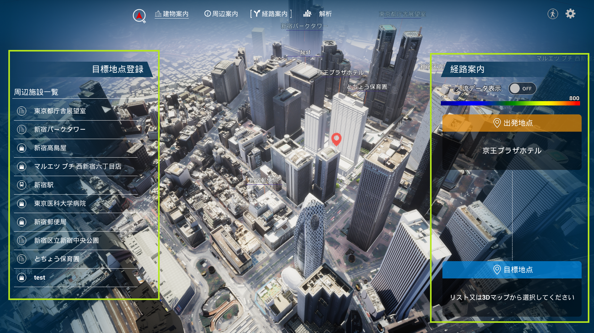

# 各機能の利用方法（ユーザー用画面）
# 1 本書について
本書では、PLATEAU TwinLink（以下「本ツール」という。）の操作手順について記載しています。

# 2 使い方
## 2-1 メイン画面
本ツールの実行ファイルを実行すると以下のメイン画面が表示されます。メイン画面では、3D ビュー上で表現されたデジタルツイン表示の上に、以下の機能切替ボタンが表示されます。
- 建物案内
- 周辺案内
- 経路案内
- 解析

各機能切替ボタンを押すと各機能の画面が開きます。機能画面が開いている状態でボタンを押す、又は別の機能切替ボタンを押すと機能画面が閉じます。

## 2-2 建物案内画面
建物案内画面を開くと、3Dビューの視点が建物に移動し、以下の情報が表示されます。
- ①建物の名称及び外観
- ②フロア選択パネル
- ③店舗情報表示パネル
- ④表示階層の切替えパネル

②フロア選択パネルで閲覧したいフロアを選択すると、3Dモデルからそのフロアが切り取られます。このフロアに登録されている店舗は、3Dビュー上に名称と位置が表示され、③店舗情報表示パネルに店舗名がリストアップされます。また、④表示階層の切替えパネルにより、選択しているフロアから上下のフロアに移動できます。

③店舗情報表示パネルで、店舗名を選択すると、店舗を中心とした俯瞰視点に切り替わり、店舗情報パネル（店舗名、画像、営業時間、店舗案内）が表示されます。また、「設計情報表示」ボタンを押すと、フロアに設定された設計情報が表示されます。

## 2-3 周辺案内画面
周辺案内画面を開くと、以下の情報が表示されます。
- ①周辺施設一覧パネル
- ②視点切替パネル
    - 視点を選択すると、カメラの位置と画角が移動します。
- ③周辺施設情報表示パネル

①周辺施設一覧パネルから閲覧したい施設を選択すると、③周辺施設情報表示パネルが表示されます。③周辺施設情報表示パネルでは、施設についての案内と、施設周辺の情報を閲覧できます。

## 2-4 経路案内画面
経路案内画面を開くと、3D ビューは管理対象建築物を中心とした俯瞰視点に切り替わり、以下の情報が表示されます。
- ①目標地点登録パネル
- ②経路案内パネル

目標地点を①目標地点登録パネル又は3Dビュー上から選択することで、管理対象建築物からの移動ルートが表示されます。

②経路案内パネルの中段にある「徒歩」、「車」ボタンを選択することで、移動方法の切替えができ、移動時間が再計算されます。

②経路案内パネルの上段にある「人流データ表示」ボタンをONに設定すると、人流データが混雑情報としてヒートマップで表示されます。ヒートマップは描画距離が近くなるほど高解像度になるように自動的に更新されます。

## 2-5 解析画面
解析画面を開くと、以下の機能切替ボタンが表示されます。
- 経路
- 空間ID
- 気象
- POI
- 都市計画

各機能切替ボタンを押すと各機能の画面が開きます。機能画面が開いている状態でボタンを押す、又は別の機能切替ボタンを押すと機能画面が閉じます。

## 2-5-1 経路画面
経路画面では、出発地点→目標地点の順で3D マップ上の地点を選択すると、ルート検索と距離・移動時間の計測が行われます。また、移動方法は「徒歩」および「車」ボタンを選択して変更できます。

経路情報は、エクスポートボタンを選択すると、Shapefile として出力できます。

## 2-5-2 空間ID画面
空間ID画面では、3Dマップ上の調べたいエリアを選択すると、赤色のボクセルが表示され、解析情報パネルにはそのボクセル内の以下の情報が表示されます。
- 通行人数
- 建築物数

解析情報パネルの上部にあるズームレベルスライダーから、解析範囲を表すボックスのサイズを変更できます。

解析情報パネルの上部にある人流データ切替ボタンから、人流データ（混雑状況を表したヒートマップ）の表示を選択できます。

画面下部にある日時変更パネルでは、スライダーを操作することで、解析対象の日時を変更できます。また、「リアルタイム」チェックボックスを選択すると、最新の情報をリアルタイムに解析することが可能です。

## 2-5-3 気象画面
気象データ表示画面では、気象データパネルの「データを選択」ボタンからエクスプローラーを開き、可視化したい気象データを選択します。

気象データが読み込まれると、3Dビュー上に各センサーで計測された気温、照度、雨量、湿度、風向、気圧などが表示されます。また、気象データパネルの「データ読み込み」欄では、読み込まれたデータ名が確認できます。

画面下部にある日時変更パネルでは、スライダーを操作することで、表示する気象データの日時を変更できます。

## 2-5-4 POI画面
POI画面では、GISデータを読み込んで各地点情報を3Dビュー上に可視化できます。

まず、GISデータパネルの「データ選択」ボタンからエクスプローラを開き、可視化したいGISデータ（Shapefile）を選択します。

次に、GISデータパネルの「表示属性リスト」から、3D ビュー上で表示したい属性を選択します。dbf ファイル（Shapefile と同名のファイルが自動的に読み込まれます）に定義された属性フィールドのリストが、表示属性リストに表示されます。

そして、GISデータパネルの「データ名」欄に施設の名称を入力します。

最後に、GISデータパネルの「登録」ボタンを押すと、3Dマップ上にアイコンとGISデータが表示されます。また、画面左側の周辺施設一覧には設定したデータ名でGISデータがリストアップされます。データ名の横にある瞳の形状のアイコンで、表示と非表示を選択でき、ゴミ箱の形状のアイコンで削除ができます。

## 2-5-5 都市計画画面
都市計画画面では、PLATEAU SDK でインポートされた都市計画決定情報モデル（CityGML形式）をもとに、以下の機能を提供します。
- 各都市計画決定情報を用途別に色分けし、エリア一覧パネルに表示する
- 3D ビュー上の各エリアを色分けする
- エリア端のエフェクトの高さによって容積率を可視化する

3D ビュー上でエリア端を選択すると、画面右下のエリア情報パネルに、そのエリアの用途と容積率が表示されます。

