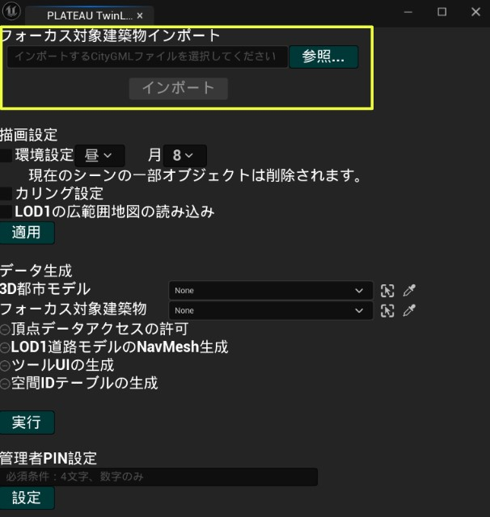
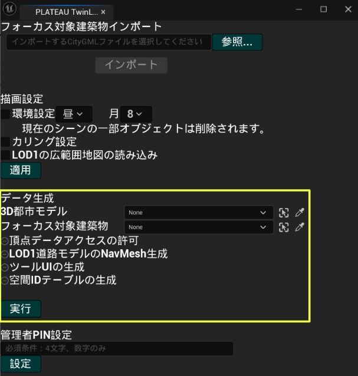
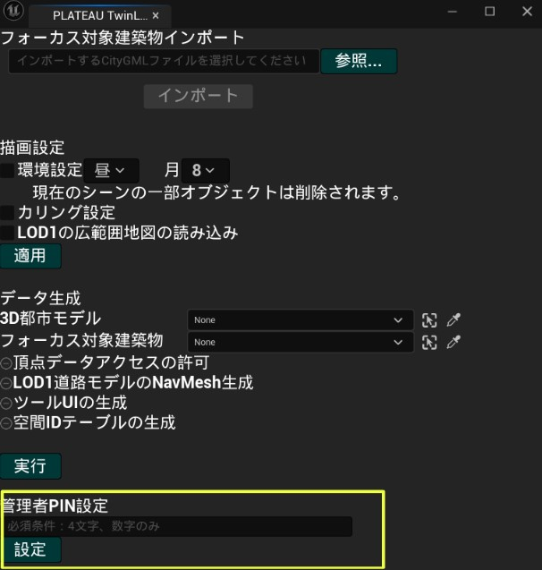

# 環境構築手順書
# 1 本書について
本書では、PLATEAU Twinlink（以下「本ツール」という。）の環境構築手順について記載しています。本システムの構成や仕様の詳細については[技術検証レポート](https://)も参考にしてください。

# 2 動作環境
本ツールの動作環境は以下のとおりです。

| 項目 | 推奨動作環境 |
| - | - |
| OS | Microsoft Windows 11 |
| CPU | Intel Core i9-12900H以上 |
| GPU | NVIDIA GeForce RTX3080 Ti Laptop以上 |
| メモリ | 32GB以上 |

# 3 データの準備
本ツールの動作には、LOD4の建築物モデルが必要です。LOD4建築物モデルとは、[3D都市モデル整備のためのBIM活用マニュアル](https://www.mlit.go.jp/plateau/file/libraries/doc/plateau_doc_0003_ver03.pdf)に従って作成されたIFCファイルを[IFC to CityGML](https://github.com/Project-PLATEAU/PLATEAU-IFC-to-CityGML2.0-LOD4)で変換したものです。詳細については[IFC to CityGML](https://github.com/Project-PLATEAU/PLATEAU-IFC-to-CityGML2.0-LOD4)のページをご参照ください。

LOD4建築物モデルは新規に作成する以外にも、[オープンデータ](https://www.geospatial.jp/ckan/organization/toshi?q=LOD4&sort=metadata_modified+desc)として提供されている既存のファイルを活用することができます。

# 4 インストール手順
## Unreal Engine
[Epic Games Store](https://store.epicgames.com/ja/download)からEpic Games Launcherをインストール後、Epic Games Launcherを開きます。Unreal Engine（①）→ライブラリ（②）→＋（③）を選択し、Unreal Engine 5.3をインストールしてください。

インストールされたUnreal Engineを開き、プロジェクトデフォルトとしてブループリントではなくC++を選択してから作成します。

## PLATEAU SDK及びPLATEAU TwinLink
PLATEAU SDK及び本ツールのリリースページから各プラグインのzipファイルをダウンロードしてください。作成したプロジェクトのフォルダを開き、Pluginsという名前のフォルダを作成後、各zipファイルを展開して格納します。

# 5 Unreal Engineのレベル作成手順
## ゲームモードの設定
「World Settings」を押下した後、「GameMode Override」の値を「TwinLinkGameMode」に設定します。

## 3D都市モデルのインポート
PLATEAU SDK から使用したい3D都市モデルをインポートします。インポート方法については[PLATEAU SDK のマニュアル](https://project-plateau.github.io/PLATEAU-SDK-for-Unreal/manual/ImportCityModels.html)を参照してください。

## TwinLinkの設定
上部メニューから「PLATEAU TwinLink」を選択すると、設定ウィンドウが開きます。

まず「フォーカス対象建築物インポート」からLOD4の建築物を以下の手順でインポートします。

1. 参照ボタンを押した後、エクスプローラからCityGMLファイルを選択します。
2. インポートボタンを押します。
3. インポートが完了すると「インポート完了」と表示されます。

描画設定では、以下の項目の設定が可能です。

- 環境設定
    - 環境設定にチェックを入れることで、時間帯と月を指定できます。
- カリング設定
    - 遠距離のオブジェクトを非表示にしたい場合はこの項目にチェックを入れます。
- LOD1の広範囲地図の読み込み
    - インポートした3D都市モデルより広範囲の地形モデルが追加でインポートされます。

下部の「適用」ボタンを押すことでチェックが入れられた描画設定が反映されます。

「データ生成」項目では、3D都市モデルとフォーカス対象建築物（FocusTargetという名前でインポートされています）のアクターを選択し、下部の実行ボタンを押すとツールの実行に必要なデータの生成が行われます。

生成が完了すると「データの生成が完了しました。」と表示されます。

管理者PIN設定では、空欄に数字4文字を入力し、設定ボタンを押すことで、管理モードに入るためのPINを設定できます。PLATEAU TwinLinkウィンドウを閉じて再生ボタンを押すと、先ほど設定した内容でシーンを再生できます。

## ビルドアプリの作成
スタンドアロンで実行可能なexeファイルを生成する方法について記載します。

プロジェクト設定からGame Default Mapを作成したシーンに設定します。

プラットフォーム→Windows→パッケージ化の順に選択し、ビルドアプリを作成します。

