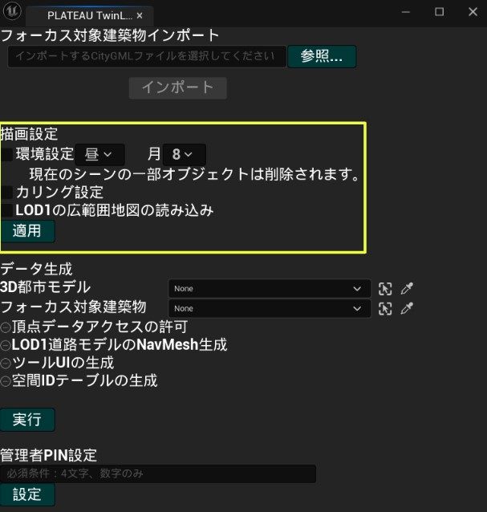

# 各種インストール
## Unreal Engine
[Epic Games Store](https://store.epicgames.com/ja/download) からEpic Games Launcher をインストール後、Epic Games Launcher を開く。Unreal Engine（①）→ライブラリ（②）→＋（③）を選択し、Unreal Engine 5.3 をインストールする。

インストールされたUnreal Engine を開き、プロジェクトデフォルトとしてブループリントではなくC++を選択してから作成する。

## PLATEAU SDKおよびPLATEAU Twinlink
PLATEAU SDK、本ツールのリリースページから各プラグインのzip ファイルをダウンロードする。作成したプロジェクトのフォルダを開き、Plugins という名前のフォルダを作成後、各zip ファイルを展開して格納する。

# シーン作成
## 3D都市モデルのインポート
PLATEAU SDK から使用したい3D 都市モデル、フォーカス対象建築物をインポートする。インポート方法については[PLATEAU SDK のマニュアル](https://project-plateau.github.io/PLATEAU-SDK-for-Unreal/manual/ImportCityModels.html)を参照されたい。

## TwinLink の設定
上部メニューから「PLATEAU TwinLink」を選択すると、設定ウィンドウが開かれる。描画設定では、環境設定にチェックを入れることで、時間帯と月を指定できる。また、カリング処理を有効にしたい場合はカリング設定にチェックを入れる。下部の適用ボタンを押して描画設定を適用させる。

データ生成項目では、3D 都市モデルと管理対象建築物（LOD4）のデータを選択して、下部の実行ボタンを押すとデータの生成が行われる。生成が完了すると「データの生成が完了しました。」と表示される。管理者PIN 設定では、空欄に数字4 文字を入力し、設定ボタンを押すことで、管理モードに入るためのPIN を設定できる。PLATEAU TwinLink ウィンドウを閉じて再生ボタンを押すと、先ほど設定した内容でシーンを再生できる。

## ビルドアプリの作成
プロジェクト設定からGame Default Map を作成したシーンに設定する。

プラットフォーム→Windows→パッケージ化を選択し、ビルドアプリを作成する。
