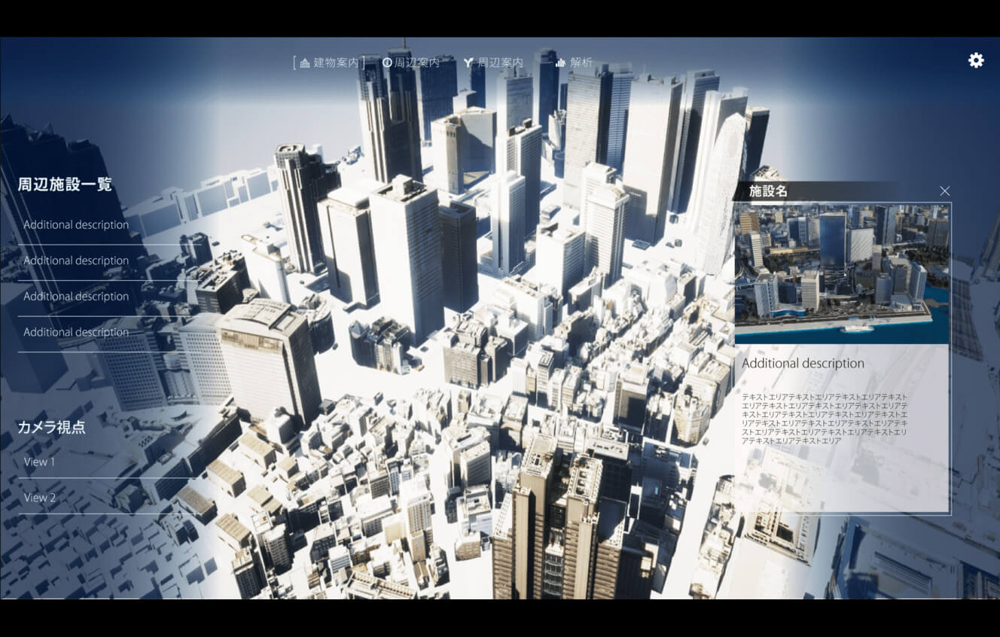

# PLATEAU TwinLink（3D都市モデル、BIMモデル、空間IDを統合した都市開発支援ツール） <!-- OSSの対象物の名称を記載ください。分かりやすさを重視し、できるだけ日本語で命名ください。英語名称の場合は日本語説明を（）書きで併記ください。 -->

## 1. 概要 <!-- 本リポジトリでOSS化しているソフトウェア・ライブラリについて1文で説明を記載ください -->
本リポジトリでは、Project PLATEAUの令和5年度のユースケース開発業務の一部であるdt23-05「3D都市モデル、BIMモデル、空間IDを統合した都市開発支援ツールの開発」について、その成果物である「PLATEAU TwinLink」のソースコードを公開しています。

## 2. 「PLATEAU TwinLink」について <!-- 「」内にユースケース名称を記載ください。本文は以下のサンプルを参考に記載ください。URLはアクセンチュアにて設定しますので、サンプルそのままでOKです。 -->
PLATEAU TwinLinkは、「3D都市モデル」、「BIMモデル」、「空間ID」を活用し、都市計画の検討や都市開発のプロポーザル、建築設計の合意形成、シティプロモーションなど、まちづくりの各フェーズで利用可能な汎用的な都市開発支援ツールです。

本ツールでは、一般消費者へ不動産販売を行うデベロッパーやまちづくりの現場において住民説明を行う事業者（デベロッパー・行政・まちづくり団体）などのユーザーを想定し、直観的なUI操作やハイクオリティのビジュアライゼーションを行っています。

本ツールを活用することによって、不動産販売や住民説明の現場において、模型や映像、パンフレット等を使ったこれまでのプロモーションツールと比較し、一般消費者や一般住民に対して内容をより分かりやすく、魅力的に伝えることができるようになることを目指しています。

詳細については[技術検証レポート](https://)を参照してください。

## 3. 利用手順 <!-- 下記の通り、GitHub Pagesへリンクを記載ください。URLはアクセンチュアにて設定しますので、サンプルそのままでOKです。 -->
本ツールの構築手順及び利用手順については[利用チュートリアル](https://)を参照してください。

## 4. 機能一覧 <!-- OSS化対象のシステムが有する機能を記載ください。 -->
| 大分類 | 小分類 | 機能名 | 機能説明 |
| --- | --- | --- | ---- |
| Unreal Engine Editor | | デジタルツイン基盤インポート機能 | PLATEAU SDKによってUnreal Engineにインポートされた3D都市モデルの見栄えの改善、最適化を行い、ツールへの組み込み、実行時のツールUIの生成を行う。 |
| Runtime | 共通 | 管理者モード切替機能 | 管理者モードの有効化・無効化を切り替える。 |
| | 建物ビュー | 階層表示機能 | LOD4建築物モデルについて、階層を選択して表示する。 |
| | | 建物内部施設表示・管理機能 | 建物ビューで表示する施設の登録・管理・表示を行う。 |
| | | 建築物設計情報表示機能 | LOD4建築物の各階層での間取りを画像として設定・表示する。 |
| | シティビュー | 周辺施設情報表示・管理機能 | シティビューで表示する周辺施設の登録・管理・表示を行う。 |
| | 共通 | 視点操作機能 | ビューポートでの視点操作を行う。 |
| | シティビュー | 視点保存/切替機能 | 視点の位置・回転に名前を付けて保存する機能を提供する。また、保存された視点の位置・回転を適用する。 |
| |  | 経路案内機能 | 京王プラザホテルから周辺施設情報で選択した施設までの移動経路を表示する。 |
| |  | 経路探索機能 | 選択任意の地点間の移動経路を表示する。 |
| |  | 属性情報表示機能 | 地物の属性情報を表示する。 |
| |  | 空間IDテーブル生成機能 | オブジェクトを入力として空間IDテーブルへの登録を行う。 |
| |  | 外部空間IDデータ連携機能 | リアルタイム人流データを空間IDデータ化し、本ツールと連携する。 |
| |  | リアルタイムデータ表示機能 | 空間IDデータ連携機能から取得された人流情報を表示する。 |
| |  | 静的データ表示機能 | ファイルとして入力された気象データを表示する。 |
| |  | GISデータ表示機能 | ファイルとして入力されたGISデータを表示する。 |
| |  | 空間ID解析機能 | 選択した任意の地点の空間ID内のデータを統合的に表示する。 |
| |  | 都市計画情報表示機能 | 経路探索・時間計測等、地理空間情報の分析・可視化・データ出力を行う。 |
| | 建物ビュー | 色彩変更機能 | LOD4建築物モデルの色彩を変更する。 |
| | シティビュー | アセット配置機能 | プリセットとしてあらかじめ設定された植生や都市設備等のアセットを3D 都市モデル内に配置し、位置・回転の変更、削除等編集を行う。 |
| その他 | | IFC to CityGMLの改修変換機能 | FMEでのIFCからCityGMLに変換する。 |

## 5. 利用技術
| 種別              | 名称   | バージョン | 内容 |
| ----------------- | --------|-------------|-----------------------------|
| ソフトウェア      | [Unreal Engine](https://www.unrealengine.com/ja/unreal-engine-5) | 5.2 | ツールをプラグインとして組み込むゲームエンジン |
|       | [FME Workbench](https://docs.safe.com/fme/html/FME-Flow/AdminGuide/FME_Workbench.htm) | 2022.2.6 | IFCからCityGMLへの変換で利用 |
| ライブラリ      | [PLATEAU SDK for Unreal](https://github.com/Project-PLATEAU/PLATEAU-SDK-for-Unreal) | 2.1 | PLATEAUの3D都市モデルデータをUnreal Engineで扱うためのツールキット |
|       | [3D空間ID共通ライブラリ](https://github.com/spatial-id/javascript-sdk) | 1.0.0 | 位置情報と空間IDを相互変換及び操作するための共通ライブラリ |
|       | [shapelib](https://github.com/OSGeo/shapelib) | 1.5 | Shapefile読み書きのためのライブラリ |

## 6. 動作環境 <!-- 動作環境についての仕様を記載ください。 -->
| 項目               | 推奨動作環境                                                                                                                                                                                                                                                                                                                                    |
| ------------------ | ----------------------------------------------------------------------------------------------------------------------------------------------------------------------------------------------------------------------------------------------------------------------------------------------------------------------------------------------- |
| OS                 | Microsoft Windows 11                                                                                                                                                                                                                                                                                                                  |
| CPU                | Intel Core i9-12900H 以上                                                                                                                                                                                                                                                                                                                               |
| メモリ             | 32GB 以上                                                                                                                                                                                                                                                                                                                                         |
| ネットワーク       | ○○機能を使用しない場合はネットワーク環境は不要

## 7. 本リポジトリのフォルダ構成 <!-- 本GitHub上のソースファイルの構成を記載ください。 -->
ソースファイルは`Source`フォルダ以下にモジュールごとに配置されています。

| フォルダ名 |　詳細 |
|-|-|
| ThirdParty | サードパーティ製ライブラリ |
| TwinLink | システムのコアモジュール |
| TwinLinkEditor | Unrealエディタで動作するモジュール |
| TwinLinkGizmo | 3DビューにGizmoを描画するモジュール |
| TwinLinkWidgets | ランタイムUIモジュール |

## 8. ライセンス <!-- 変更せず、そのまま使うこと。 -->
- ソースコード及び関連ドキュメントの著作権は国土交通省に帰属します。
- 本ドキュメントは[Project PLATEAUのサイトポリシー](https://www.mlit.go.jp/plateau/site-policy/)（CCBY4.0及び政府標準利用規約2.0）に従い提供されています。

## 9. 注意事項 <!-- 変更せず、そのまま使うこと。 -->
- 本リポジトリは参考資料として提供しているものです。動作保証は行っていません。
- 本リポジトリについては予告なく変更又は削除をする可能性があります。
- 本リポジトリの利用により生じた損失及び損害等について、国土交通省はいかなる責任も負わないものとします。

## 10. 参考資料 <!-- 技術検証レポートのURLはアクセンチュアにて記載します。 -->
- PLATEAU WebサイトのUse Caseページ「PLATEAU TwinLink」: https://www.mlit.go.jp/plateau/use-case/dt23-05/
- 技術検証レポート: https://
- 利用チュートリアル： https://